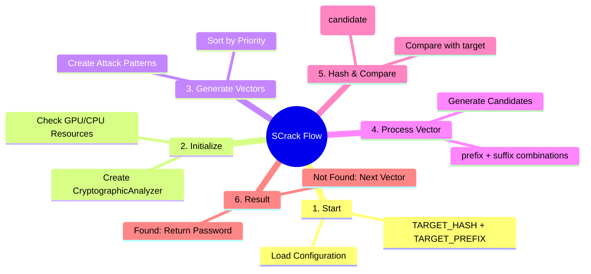

# SCrack

**SCrack** is a high-performance SHA-1 password cracker designed for partial password recovery. When you know part of a password (prefix), SCrack efficiently brute-forces the unknown portion using GPU acceleration or CPU multiprocessing.

> Note: For long password analysis, consider using Google Colab with their free T4 GPU for significantly faster processing times.

## Features

SCrack automatically generates attack vectors with varying complexity levels, prioritizing efficient search patterns. It supports both CuPy and PyCUDA for GPU acceleration, with intelligent fallback to CPU multiprocessing when GPU resources are unavailable. The engine implements batched processing with configurable search space limitations and real-time progress monitoring.

## Installation

```bash
git clone https://github.com/awiones/SCrack.git
cd SCrack
pip install -r requirements.txt

# Optional GPU support
pip install cupy  # or: pip install pycuda
```

## Usage

Edit the configuration in `crack.py`:

```python
TARGET_HASH = "f7603d2a230e3af777f71b9d5399078321305431"
TARGET_PREFIX = "fanta"
```

Run the analysis:

```bash
python crack.py
```

## Configuration Options

```python
MAX_SEARCH_SPACE = 100000000000    # Maximum combinations to attempt
BATCH_SIZE = 100000                # Candidates per processing batch  
NUM_WORKERS = mp.cpu_count()       # CPU cores for parallel processing
```

Customize character sets for specific patterns:

```python
# Numeric only
charset = string.digits

# Alphanumeric
charset = string.ascii_lowercase + string.digits

# Full character set
charset = string.ascii_letters + string.digits + "!@#$%^&*"
```

## How It Works

SCrack generates multiple attack vectors combining the known prefix with different suffix lengths and character sets. The system starts with shorter, probable combinations and expands to longer suffixes with comprehensive character sets. Each vector is prioritized by computational efficiency, automatically skipping those exceeding the maximum search space.



## Example Output

```
PASSWORD FOUND: ca95818
Time taken: 0.00 seconds

Verification:
Target: 73267e648d4278b29e8c99948393e146dfd60aae
Found : 73267e648d4278b29e8c99948393e146dfd60aae
Match : True

Analysis Status: SUCCESS
```

## Requirements

- Python 3.7+
- NumPy
- CuPy or PyCUDA (optional, for GPU acceleration)

## License

MIT License - see [LICENSE](https://github.com/awiones/SCrack/blob/main/LICENSE) file for details.

## Disclaimer

This tool is for legitimate security analysis, password recovery, and educational purposes only. Ensure proper authorization before analyzing any hash values.
